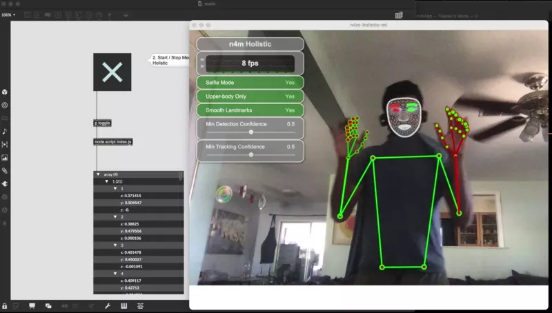

# 

Wraps [MediaPipe](https://mediapipe.dev) inside electron and serves the detected parts via MaxAPI.



# Usage
1. Install npm dependencies by clicking the indicated button. You only
   have to do this once!
2. Click on the toggle button to launch. 
3. The node.script will emit the detected results as JSON.

# How it works

Front end Electron.js served page:

```js
const SocketIOClient = require("socket.io-client");
const io = new SocketIOClient("http://localhost:4512");
const socket = io.connect();
socket.on("connect", () => {
	console.log("Connected to Max 8");
});

function sendToMaxPatch(poses) {
	socket.emit("dispatch", [poses]);
}
```

Use as needed; example:

```js

function onResults(results) {
      		sendToMaxPatch([results.rightHandLandmarks, results.leftHandLandmarks, results.faceLandmarks,results.poseLandmarks]);

        ......

```

# Acknowledgements
Inspired by [n4m-posenet](https://github.com/yuichkun/n4m-posenet).
